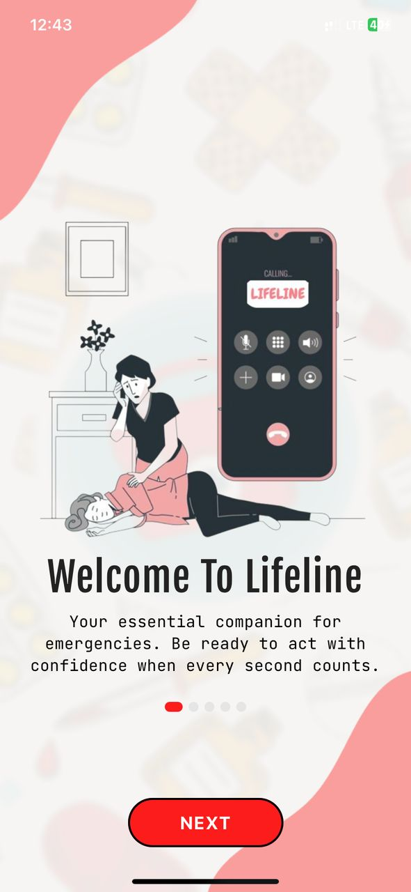
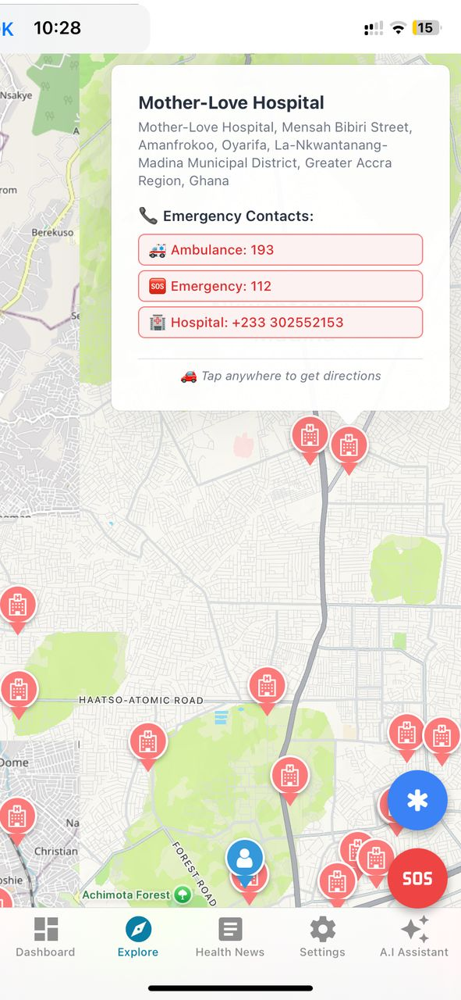
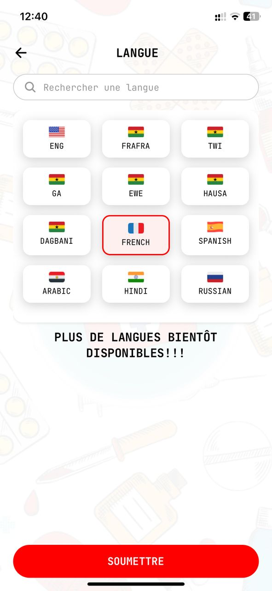
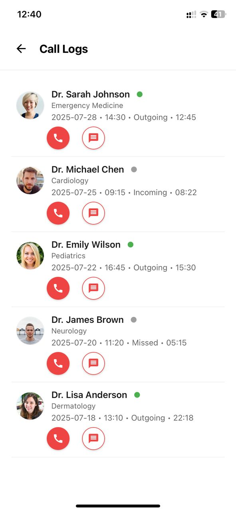
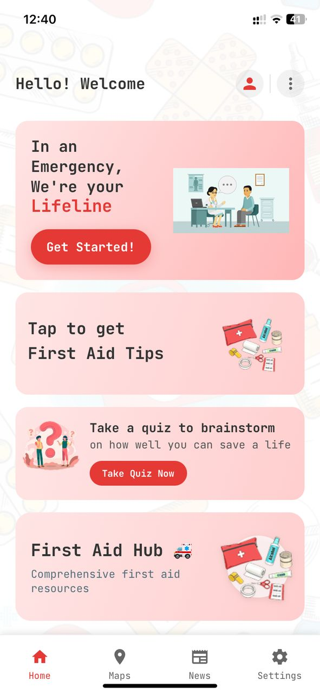
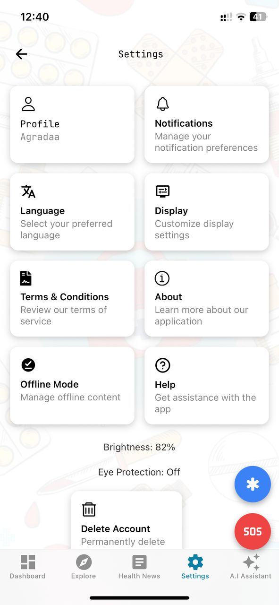
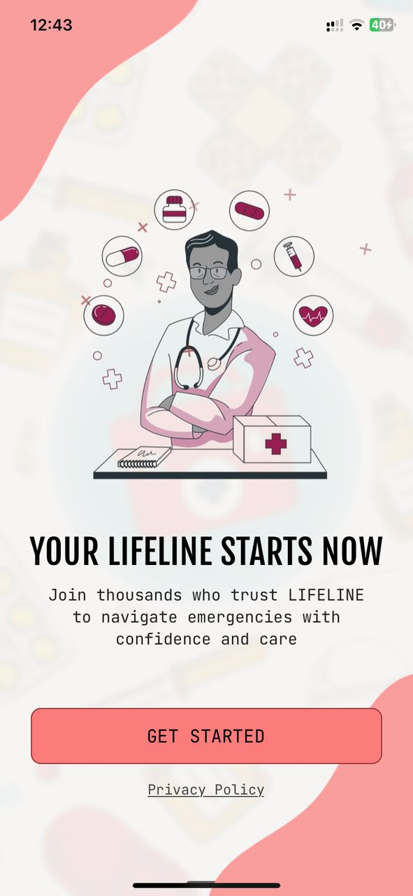

# Lifeline App 🚑

A comprehensive first aid and emergency medical assistance application.

## 📱 Screenshots

### First Aid Instructions
<div style="display: flex; justify-content: center; margin: 10px 0;">
  
</div>
*Detailed first aid instructions for various medical situations*

### Maps Feature
<div style="display: flex; justify-content: center; margin: 10px 0;">
  
</div>
*Maps feature to help users find emergency services*

### Multilingual Support
<div style="display: flex; justify-content: center; margin: 10px 0;">
  
</div>
*Supports multiple languages including English, French, Spanish, Twi and more*

### Messages Feature
<div style="display: flex; justify-content: center; margin: 10px 0;">
  
</div>
*Send messages to emergency services*

### Guest Profile
<div style="display: flex; justify-content: center; margin: 10px 0;">
  
</div>
*Guest profile to store user information*

### Settings
<div style="display: flex; justify-content: center; margin: 10px 0;">
  
</div>
*Settings to change user information*

### Get Started
<div style="display: flex; justify-content: center; margin: 10px 0;">
  
</div>
*Get started to start using the app*

---

## Welcome to your Expo app 👋

This is an [Expo](https://expo.dev) project created with [`create-expo-app`](https://www.npmjs.com/package/create-expo-app).

## Get started

1. Install dependencies

   ```bash
   npm install
   ```

2. Start the app

   ```bash
   npx expo start
   ```

In the output, you'll find options to open the app in a

- [development build](https://docs.expo.dev/develop/development-builds/introduction/)
- [Android emulator](https://docs.expo.dev/workflow/android-studio-emulator/)
- [iOS simulator](https://docs.expo.dev/workflow/ios-simulator/)
- [Expo Go](https://expo.dev/go), a limited sandbox for trying out app development with Expo

You can start developing by editing the files inside the **app** directory. This project uses [file-based routing](https://docs.expo.dev/router/introduction).

## Get a fresh project

When you're ready, run:

```bash
npm run reset-project
```

This command will move the starter code to the **app-example** directory and create a blank **app** directory where you can start developing.

## Learn more

To learn more about developing your project with Expo, look at the following resources:

- [Expo documentation](https://docs.expo.dev/): Learn fundamentals, or go into advanced topics with our [guides](https://docs.expo.dev/guides).
- [Learn Expo tutorial](https://docs.expo.dev/tutorial/introduction/): Follow a step-by-step tutorial where you'll create a project that runs on Android, iOS, and the web.

## Join the community

Join our community of developers creating universal apps.

- [Expo on GitHub](https://github.com/expo/expo): View our open source platform and contribute.
- [Discord community](https://chat.expo.dev): Chat with Expo users and ask questions.
